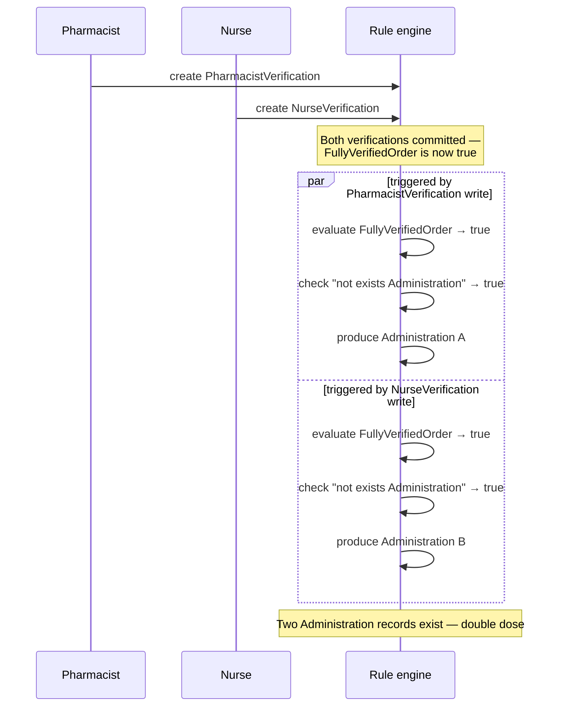
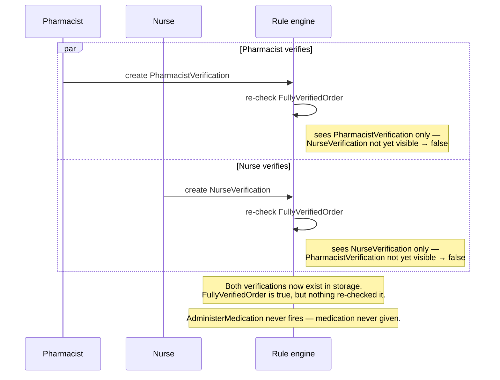

# Stress test: break Velle with a complicated system

Domain: an ICU patient monitoring and medication administration system. Chosen deliberately — it's real, high-stakes (so "the compiler should catch this" actually matters), and it forces several dimensions that the invoice/payment and support-ticket examples never touched, rather than mashing together unrelated hard cases artificially.

## 1. Concurrent writes to the same shape

Two nurses record vitals for the same patient within seconds of each other. Every rule and `produces` guard built so far quietly assumes something like single-writer, one-thing-happens-at-a-time semantics. What does `produces` even mean when two legitimate, independent writes race to satisfy the same refinement first?

> The human system design layer of abstraction is to define the requirements around rules/conditions.

### Resolution, part 1: capture-and-aggregate is already the answer for independent contributions

Two nurses recording readings "at the same time" isn't two writes racing for the same field — it's two new shape instances, the same as two `Payment` instances against one `Invoice`:

```
shape VitalReading {
    patient: one Patient
    recordedBy: one Nurse
    systolicBP: integer
    recordedOn: DateTime
}
```

Nothing conflicts, because nothing is overwritten. `Invoice.balance` was already "derived from immutable facts, not stored" — the same idiom, just not previously connected to concurrency. Any data with multiple independent contributors should default to this shape, and the write-conflict question stops applying.

For a genuinely single-owner mutable fact (`Patient.room`), last-in-wins is correct and atomicity of the write is a computer concern, not a human one — a compiled guardrail (same category as forced prepared statements), not new Velle syntax. The one case that looks like it needs a mutable counter with read-modify-write (`availableBeds -= 1`) is itself a signal to model it as events-plus-derivation instead (`Admission`/`Discharge` shapes, `available` derived) rather than inventing a third mechanism — the derived-property idiom structurally discourages the antipattern that causes lost updates in ordinary code.

### Resolution, part 2: the sharper problem is check-then-act atomicity, not field writes

The actually hard case isn't a value getting corrupted — it's a *decision* made against a snapshot of derived state that's stale by the time the effect commits. Concrete case: `available = totalBeds - count(activeAdmissions)`. Two admission requests both check `available > 0`, both see it true because neither's `Admission` has committed yet, both proceed — the ward is now over capacity. `produces` doesn't help: it guards a rule against firing twice *for the same input*, not two *different* inputs racing over a shared, finite resource.

This needs a new rule modifier, `requires`, checked atomically with the rule's effect rather than filtered like an ordinary `where`. It's the concrete form the human's note above takes — the human states the requirement (the invariant), not the concurrency mechanism:

```
rule AdmitPatient on AdmissionRequest produces Admission
    requires count(ward.admissions where ActiveAdmission) < ward.totalBeds
{
    Admission for ward patient: request.patient
}
```

The distinction from `where`: a refinement is purely observational — checking it never blocks anything (per "refinements are pure predicates, not triggers"). `requires` is enforced: the compiler must guarantee that if two concurrent `AdmissionRequest`s would each satisfy it independently but not jointly, only as many succeed as the resource allows. The human states *what* invariant must hold, not *how* to enforce it (lock, transaction, optimistic retry) — that mechanism is pushed into compiled guardrails, consistent with the human/computer-concerns split in Philosophy.

What happens to the request that loses the race doesn't need new machinery: it becomes a `DeniedAdmissionRequest` refinement, the same errors-are-refinements pattern as `FailedCharge`. No `return false`, no exception — a different outcome shape that other rules (waitlist it, notify the requester) can react to.

## 2. Rolling/windowed conditions, not point-in-time ones

"Alert if systolic BP is below 90 for 3 consecutive readings within a 10-minute window." Every refinement built so far (`balance <= 0`, `count(...) >= 3`) evaluates against a snapshot of current data. This needs a condition over an ordered *sequence* of past readings — a fundamentally different shape of predicate than anything in `where` so far.

### Resolution: no new primitive needed

```
shape LowReading = VitalReading where systolicBP < 90

shape ThirdConsecutiveLowReading = VitalReading where
    systolicBP < 90
    and count(patient.vitalReadings where LowReading and recordedOn >= (this.recordedOn - 10 minutes) and recordedOn <= this.recordedOn) >= 3
```

```
shape Alert {
    reading: one VitalReading
    raisedOn: DateTime
}

rule RaiseLowBpAlert on ThirdConsecutiveLowReading produces Alert {
    Alert for this raisedOn: now
}
```

"Windowed" decomposes into `count` (already established) plus a relative time-range filter (`recordedOn >= this.recordedOn - 10 minutes`) — the same relative-date arithmetic already used in `GracePeriod` (`now + 14 days`). `this` inside the nested `where` refers to the outer reading being defined, consistent with how `this` already works in `not exists Receipt for this`. The "event after the third reading" is just an ordinary rule — `on ThirdConsecutiveLowReading produces Alert` — zero new mechanism, same as every other rule in the doc. Two stress tests in, and neither has actually forced new syntax: #1 needed one new modifier (`requires`), #2 needed none.

### Edge case that needs an explicit answer, not a silent default

`count(...) >= 3` within the window catches "3 low readings within 10 minutes" even if a normal reading is interspersed between them (low, low, normal, low) — it doesn't require the 3 to be strictly *consecutive*, only that 3 qualifying readings exist somewhere in the trailing window. Whether that's correct depends on clinical intent the language can't infer: does an interrupting normal reading reset the streak, or does the threshold-within-a-window interpretation (arguably the clinically safer default) hold regardless? This is the same category of thing as #5's reversal question — not a language gap, a decision that has to be made explicitly by whoever is writing the spec, and the language should make it easy to state either way rather than picking one silently. A strictly-consecutive version would need to additionally assert nothing ≥ 90 exists between the earliest and latest of the 3 qualifying readings — which does start to require picking out "the earliest of the 3," a selection/ordering operation this doc hasn't needed anywhere else yet.

>

## 3. Event-anchored timeouts, not calendar schedules

"If the on-call nurse hasn't acknowledged within 5 minutes, escalate to the attending physician." This isn't `on Daily` — it's "N minutes after event E, if condition C still holds, do X." The postfix schedule mechanism only handles fixed cadence; it has no notion of a countdown that starts from a specific, arbitrary event.

### Partial resolution: `setTimeout` is the same mechanism as `setInterval`, differently anchored

An event-anchored timeout doesn't need to be captured any differently than a `produces` shape — the timeout check is still just a shape the scheduling framework produces, the same way `Daily` produces a tick. What's different is only the anchor: relative to an event instance plus a duration, instead of a fixed calendar cadence.

```
shape Alert {
    reading: one VitalReading
    raisedOn: DateTime
    acknowledgedOn: DateTime?
}

shape UnacknowledgedAlert = Alert where acknowledgedOn is none

shape AlertTimeoutCheck via schedule 10 minutes after Alert {
    alert: one Alert
    checkedOn: DateTime
}

shape UnresolvedAlertTimeoutCheck = AlertTimeoutCheck where alert is UnacknowledgedAlert

rule EscalateUnacknowledgedAlert on UnresolvedAlertTimeoutCheck produces Escalation {
    Escalation for alert escalatedOn: now
}
```

`alert is UnacknowledgedAlert` — checking whether a *related* shape currently satisfies a refinement — reuses the same pattern as `not (this is SettledInvoice)` in `ReopenedInvoice`, just traversing a relationship instead of testing `this` directly. Multi-level escalation chains (nurse → doctor → attending) compose with zero additional mechanism: each level's `Escalation` is just the next level's anchor (`via schedule 15 minutes after Escalation`). `AlertTimeoutCheck` also doesn't need a `produces`-style anti-duplicate guard — "one per `Alert` instance" is inherent to what an event-anchored schedule means, the way `Daily` inherently means "one per day."

**Not actually resolved:** all of this is shape/rule-level modeling, and it only works if the scheduling framework itself supports "anchor to an event instance + duration" as a trigger kind. That framework is still the same deferred, undesigned thing flagged in `LANGUAGE.md` for calendar cadences (`Daily`, `Hourly`) — this doesn't newly defer anything, but it does add a second requirement onto that already-open item rather than closing it. Whether `via schedule <duration> after <Shape>` is even the right surface syntax for the eventual scheduling construct is also unverified — it was picked to look consistent with `via schedule every <interval>`, not derived from anything settled.

>

## 4. Rendezvous / join conditions

A medication order requires independent verification from both a pharmacist *and* a nurse before administration is allowed — two separate produced shapes, from two separate people, both required before a third effect fires. `produces` as built is single-evidence, single-guard; nothing yet expresses "wait for two independent things."

### Setup

```
shape Patient {
    name: text
    room: text
}

shape Physician {
    name: text
}

shape Nurse {
    name: text
}

shape Pharmacist {
    name: text
}

shape MedicationOrder {
    patient: one Patient
    medication: text
    dosage: text
    orderedBy: one Physician
    orderedOn: DateTime
}

shape PharmacistVerification {
    order: one MedicationOrder
    pharmacist: one Pharmacist
    verifiedOn: DateTime
}

shape NurseVerification {
    order: one MedicationOrder
    nurse: one Nurse
    verifiedOn: DateTime
}

shape Administration {
    order: one MedicationOrder
    administeredBy: one Nurse
    administeredOn: DateTime
}
```

Two independent, unordered verifications (`PharmacistVerification`, `NurseVerification`), each producible by a different role, both required before `Administration` — the third effect — is allowed to fire. This is also the first shape in the doc that formally defines `Patient`, referenced but never declared in #1–#3.

### Attempted resolution: reuse the `and` combinator

```
shape PharmacistVerified = MedicationOrder where exists PharmacistVerification for this
shape NurseVerified      = MedicationOrder where exists NurseVerification for this

shape FullyVerifiedOrder = PharmacistVerified and NurseVerified

rule AdministerMedication on FullyVerifiedOrder produces Administration {
    Administration for this administeredBy: (NurseVerification for this).nurse administeredOn: now
}
```

The declarative shape of this is right: `and` — the same combinator from the refinement-noise doc, originally introduced for readability of static traits — turns out to also express asynchronous join/rendezvous, since refinement membership is order-independent (whichever verification arrives second is the one that makes `FullyVerifiedOrder` newly true, regardless of which one that is).

### This does not actually solve it

`produces Administration`'s guard ("not exists `Administration` for this order") is itself a check-then-act, the same shape of problem `requires` was built for in #1 — and it was never actually safe here, just untested until a scenario had two independent concurrent producers instead of one. Two concrete failure modes, worse than anything #1 exposed:

- **Double-administration.** If the pharmacist and nurse verify at genuinely the same instant, two independent triggers (`PharmacistVerification` and `NurseVerification` being created) could each cause a re-check of `FullyVerifiedOrder`. If both checks run concurrently and both see "not yet administered," both could proceed to produce an `Administration` — a real double-dose, not a duplicate email.
- **Starvation — a new failure mode #1 didn't have.** `FullyVerifiedOrder` depends on *two different* shapes joined through `MedicationOrder`. Something has to notice that a write to *either* one should trigger a re-check of the joint refinement. That reactivity-across-a-join has been silently assumed to "just work" since `FlaggedCustomer`'s `count(...)` aggregate in the invoice doc — never actually specified. If the real implementation only re-evaluates refinements using data visible at the moment of one write, both writes could land concurrently and *neither* triggered check observes both — the join condition becomes true in storage, but the rule never fires at all.

**Reframed implication:** the shape and rule statements above remain completely true regardless of the race — `produces Administration` already says, in full, "at most one `Administration` per order, produced exactly when `FullyVerifiedOrder` holds." That's not an incomplete spec, it's the whole spec. The question isn't whether a human needs new syntax to say more than that; it's whether the compiler already has enough to know it must implement this safely — and it does, from `produces` alone.

So the actual gap is a **blanket obligation on the compiler**, not a language construct: any `produces` guard must be realized as both *safe* (no duplicate effect) and *live* (never silently fails to fire once the refinement is genuinely satisfied), regardless of how many independent writers are involved. This isn't a new category of thing — it's the same compiler responsibility already stated in `## Compiled` under Language Structure ("the compiler is responsible for enforcing strong typing, ensuring the relationships are valid"), extended from static structure to runtime behavior. No new keyword needed for #4.

This also sharpens what `requires` in #1 actually is, by contrast. The bed-capacity check isn't "has this specific input already produced its evidence" — it's a constraint across *many different* inputs (many patients competing for one pool), and nothing in the language had a way to state that at all, enforced or not, before `requires`. So `requires` earns its keep for a different reason than first framed: not because `produces` needed help being atomic, but because there was no way to write that particular kind of true statement — a bound over an aggregate, not tied to a single evidence shape — in the first place.

### The two failure modes, as sequences

Double-administration — both independent triggers see the guard as satisfied before either effect commits:



Starvation — the opposite failure, neither trigger ever observes both verifications at once:



Both diagrams assume the same naive implementation: "re-evaluate a refinement using whatever's visible at the moment of one write." The first shows that assumption double-firing; the second shows the same assumption silently never firing. Neither is a corner case introduced by bad luck — they're two symptoms of the same missing guarantee.

>

## 5. Viewer-relative refinements

The same patient chart looks different to the patient, the treating doctor, and billing — some fields redacted, some visible. Every refinement so far is a pure function of the shape's own data plus `today`; this needs a refinement parameterized by *who's asking*, a dimension that doesn't exist yet.

>

## 6. Retroactive invalidation

A lab result was entered wrong, corrected an hour later — but a treatment decision was already made based on the bad value. This is reversal (#5 from `example_invoice_payment.md`) turned up several notches: it's not just "un-flag the account," it's "a past decision was made in a context that's since been proven false," which smells like it needs some notion of causality/provenance Velle hasn't had to reckon with yet.

>
