# Diagrams — Billing

Generated from the spec — a deterministic projection, regenerated by `gradle generate`; do not edit. Every diagram below is derived from the one authored description: the class diagram shows the shapes and their relationships, the state-flow diagrams show each shape's refinement memberships and what can change them, the rule graph maps the whole system's cause-and-effect on one page, and the sequence diagrams show what one act's arrival may cause. None is maintained by hand, so none can drift from the spec or from each other.

## Class diagram

`/name` marks a derived property — computed, never stored. Solid arrows are declared relationships, labeled with the declaring field (and the inferred inverse collection, where one exists). A hollow-triangle arrow reads "is a refinement of": membership is decided by the predicate in the attached note, instant by instant, not fixed at creation. Dashed arrows connect a composed refinement to the refinements it is built from.

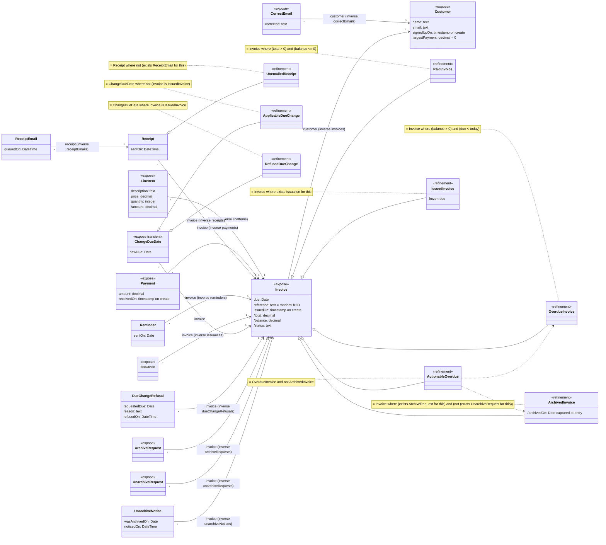

## State flow

A state is membership in a refinement, and memberships overlap — so each diagram below is one *axis* of membership, varying independently of its siblings. Arrow directions are proven from the spec (an `exists` can only be satisfied — v0 never deletes — and a fold moves one way when the input-constrained refusals pin the sign of every contribution); where no proof exists, the edge says **may flip** and is drawn in both directions.

### Invoice

4 refinements form 3 independent membership axes — each Invoice holds a position on every axis at once.
- **ActionableOverdue** = OverdueInvoice and not ArchivedInvoice — a view composed across the axes below, not an axis of its own.
- **RemindOverdue** — runs at every Weekly tick: when ActionableOverdue where not (exists (Reminder where (invoice == this) and (sentOn > (today - 7 days)))) — inserts Reminder.

**PaidInvoice / OverdueInvoice** — provably disjoint, one axis. Arrows are drawn through *neither* for legibility; a single commit may move an instance straight between named states.

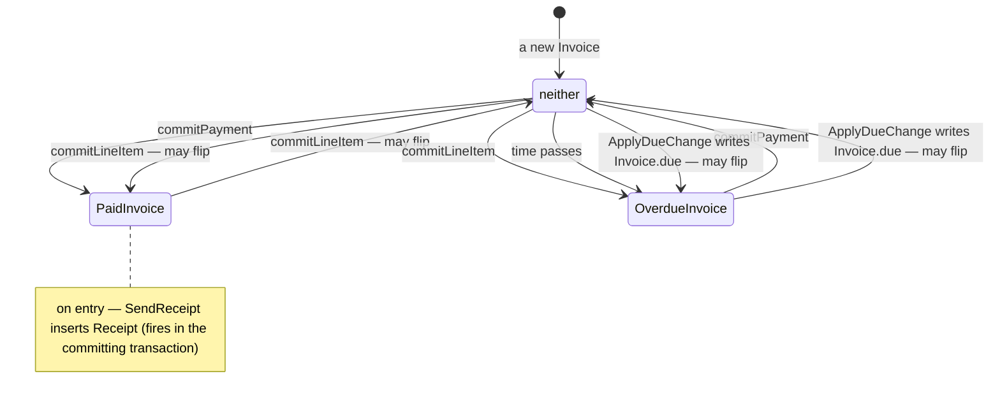

**IssuedInvoice** — one-way: entry is permanent.

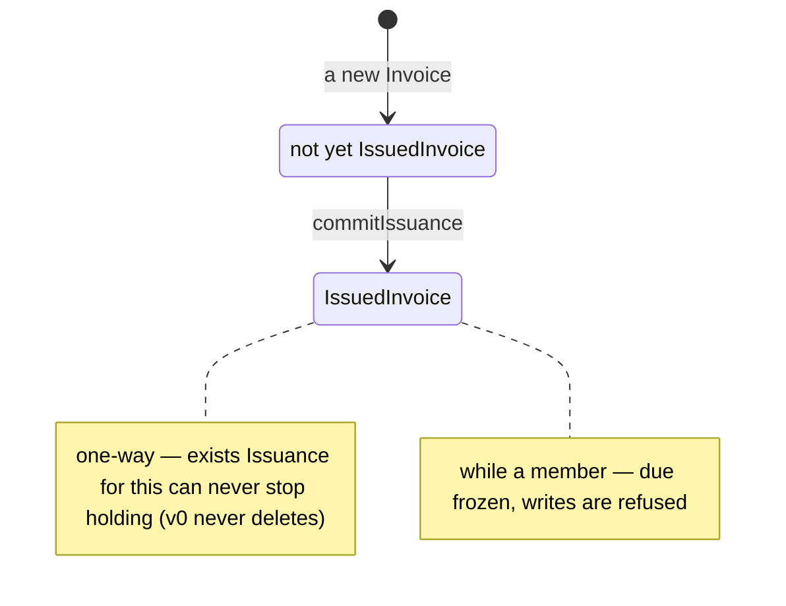

**ArchivedInvoice** — once through: enter once, leave once, never again.

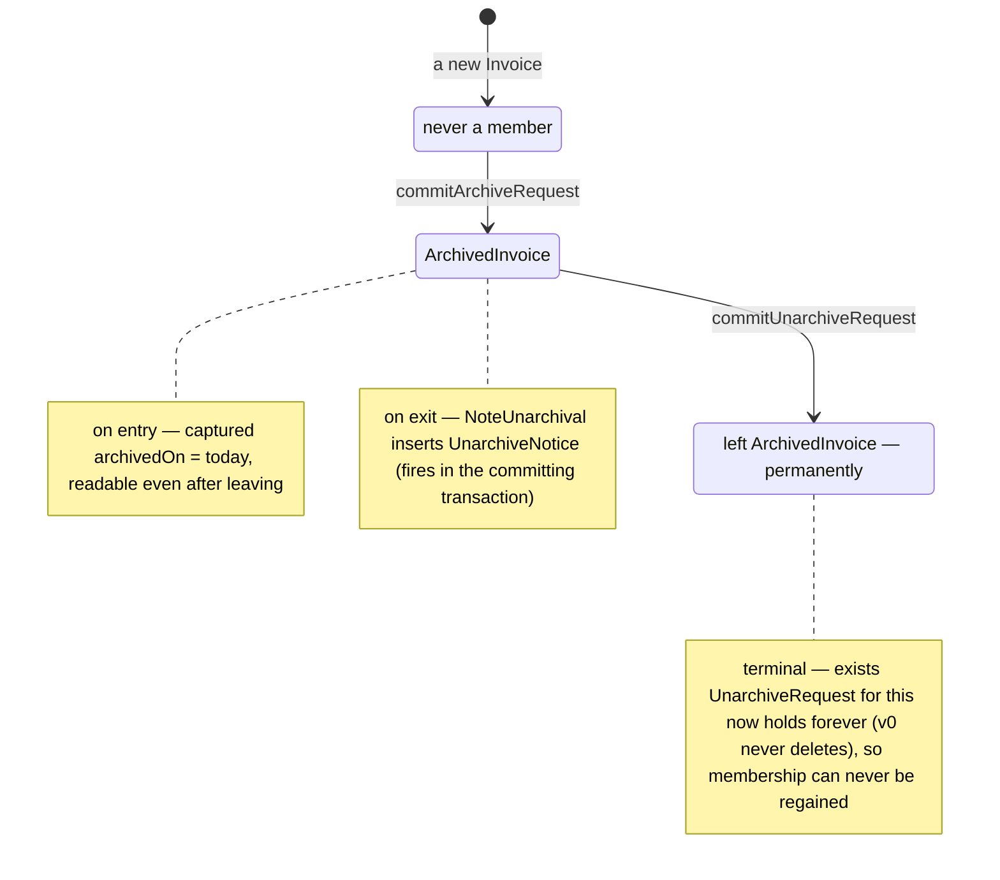

### Receipt

**UnemailedReceipt** — born a member; leaving is permanent.

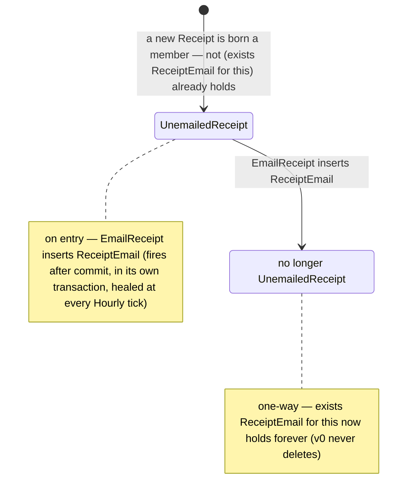

### ChangeDueDate

A transient act is an input, not state: its partitions are decided once, at the act's commit, and the instance is not kept — the final state is its removal at the envelope's close. Only its consequences persist.

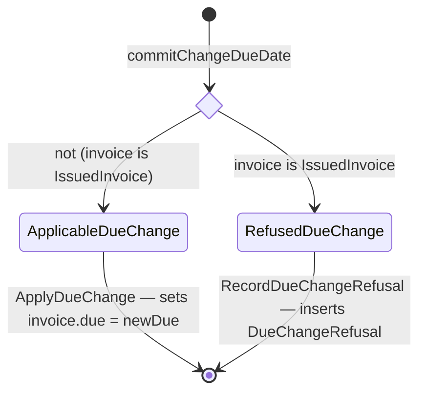

The two guards are complements, so every ChangeDueDate takes exactly one branch — the structural proof that each request gets a decision.

## Rule graph

The whole system on one page: an edge means the source's commit can change the target rule's condition — **may**-cause, like everything else here. Solid edges fire inside the same transaction envelope; dotted edges cross a boundary (`after commit`, or armed now and swept at the labeled tick). Fan-out is not a choice: every edge whose guard holds fires, in no particular order. A diamond appears only where exclusivity is proven — the accept/refuse split of an input-constrained `never`, and a transient act's complement partitions. A self-loop marked *disarms its own guard* is the guard-disarm pattern: the rule's own write makes its re-evaluation harmless. An act with no outgoing edge commits quietly — data recorded, no rule woken.

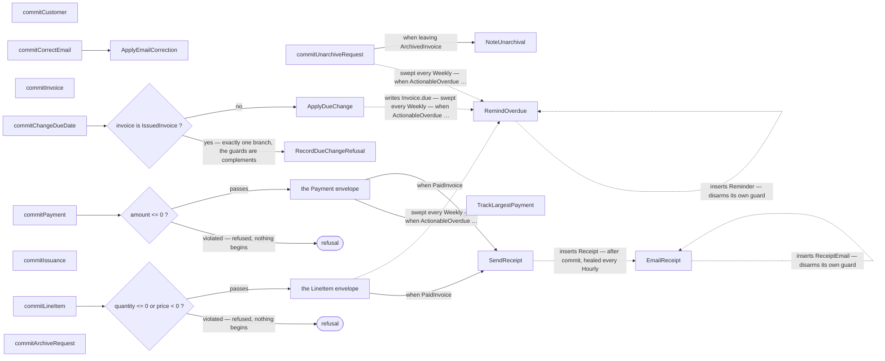

- **RemindOverdue** fires when ActionableOverdue where not (exists (Reminder where (invoice == this) and (sentOn > (today - 7 days))))

## Contention map

Where the system can work in parallel and where work must wait its turn. Work sharing a **queue key** is handled one item at a time in arrival order (U3), like any queue; work whose keys differ runs independently. A key is evaluated per call — `deposit.account` names the row that call's work queues on. Two envelopes contend iff their key sets intersect: path keys by the row they evaluate to, value keys by equal committed values, and a system-wide row with anything touching its shape. Derived from the spec's own read and write paths — no author declares a queue key.

| envelope | queues on | notes |
|---|---|---|
| commitCustomer | nothing — contends with no other work |  |
| commitCorrectEmail | `correctEmail.customer` | work with equal keys takes turns; different keys run at the same time |
| commitInvoice | `invoice.customer` | work with equal keys takes turns; different keys run at the same time |
| commitLineItem | `lineItem.invoice` | work with equal keys takes turns; different keys run at the same time |
| commitPayment | `payment.invoice`, `payment.invoice.customer` | work with equal keys takes turns; different keys run at the same time |
| commitIssuance | `issuance.invoice` | work with equal keys takes turns; different keys run at the same time |
| commitChangeDueDate | `changeDueDate.invoice`, `changeDueDate.invoice.customer` | work with equal keys takes turns; different keys run at the same time |
| commitArchiveRequest | `archiveRequest.invoice` | work with equal keys takes turns; different keys run at the same time |
| commitUnarchiveRequest | `unarchiveRequest.invoice` | work with equal keys takes turns; different keys run at the same time |
| EmailReceipt (each Hourly firing) | `this` | work with equal keys takes turns; different keys run at the same time |
| RemindOverdue (each Weekly firing) | `this` | work with equal keys takes turns; different keys run at the same time |

## Sequence diagrams

One diagram per exposed act. Each diagram is **may-fire**: a rule appears wherever the commit could affect its condition, with the condition shown as a note — whether it actually fires depends on the data at that commit. Frames (`critical`) are transaction envelopes: everything inside one frame stands or falls together.

### commitCustomer

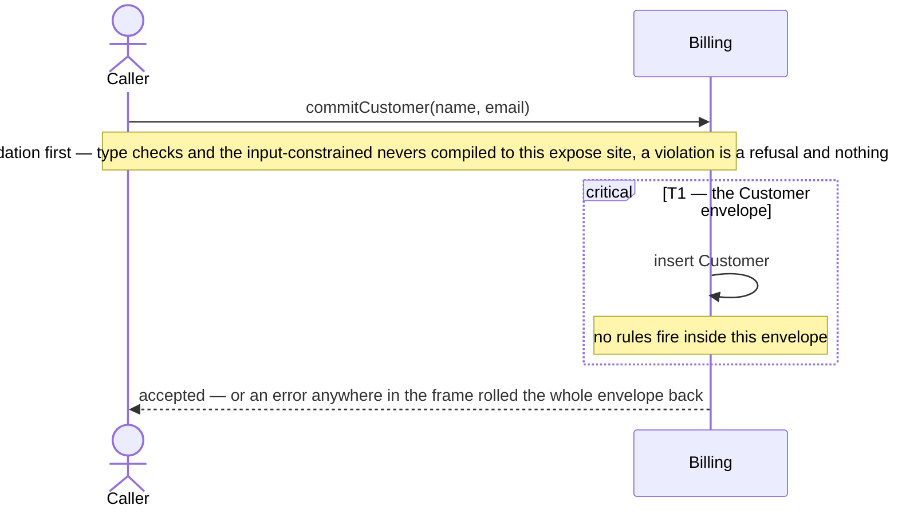

### commitCorrectEmail

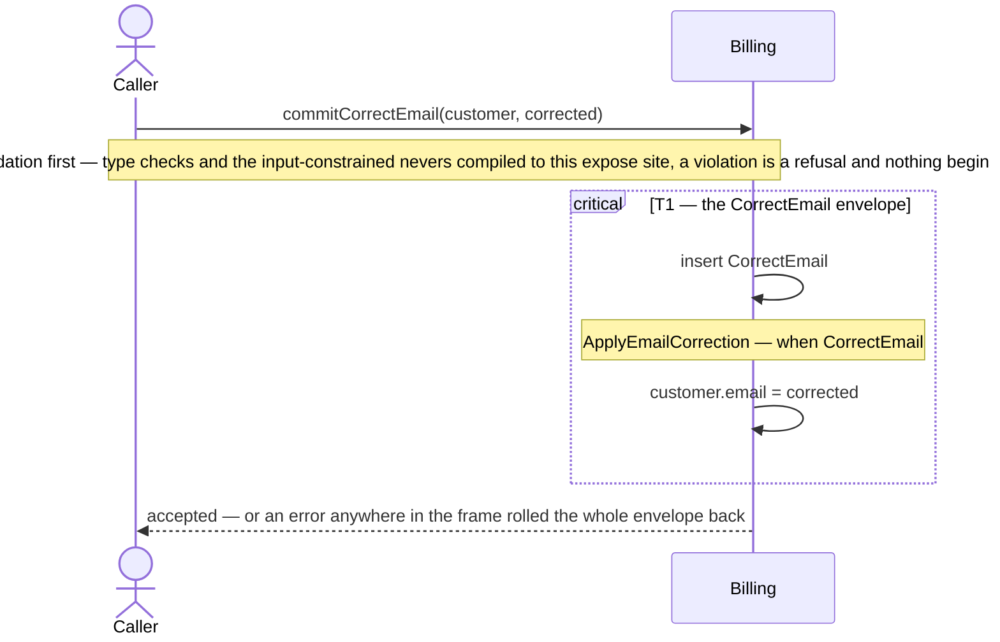

### commitInvoice

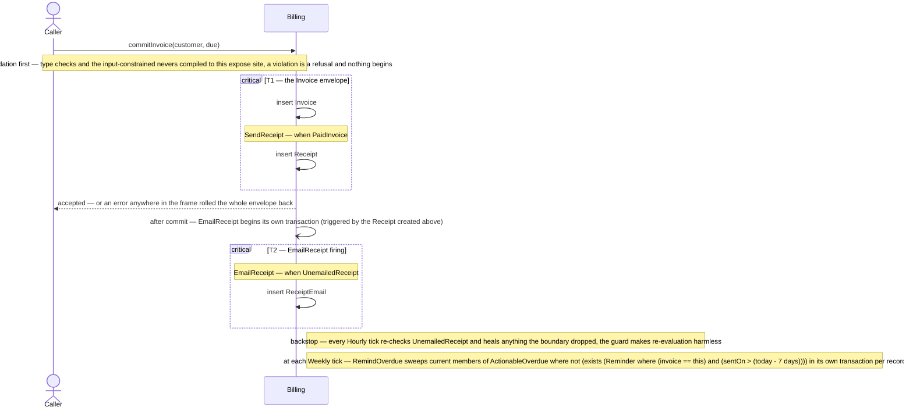

### commitLineItem

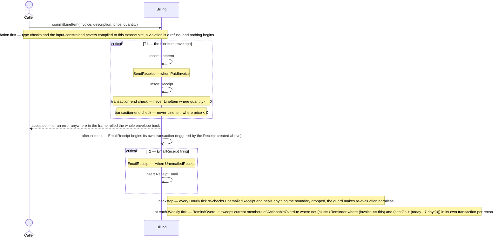

### commitPayment

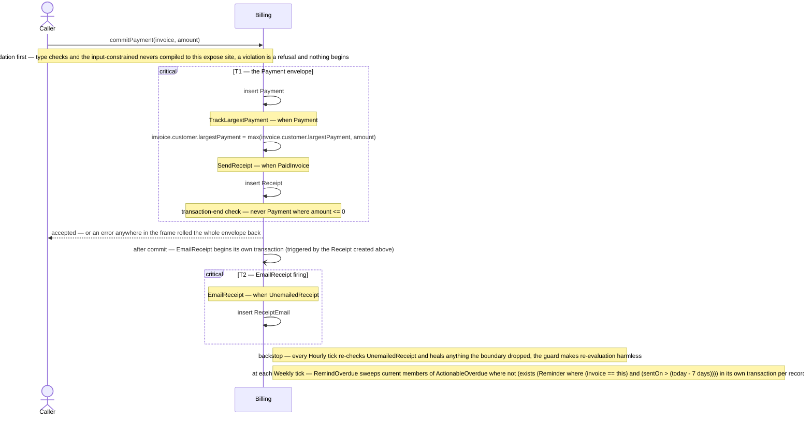

### commitIssuance

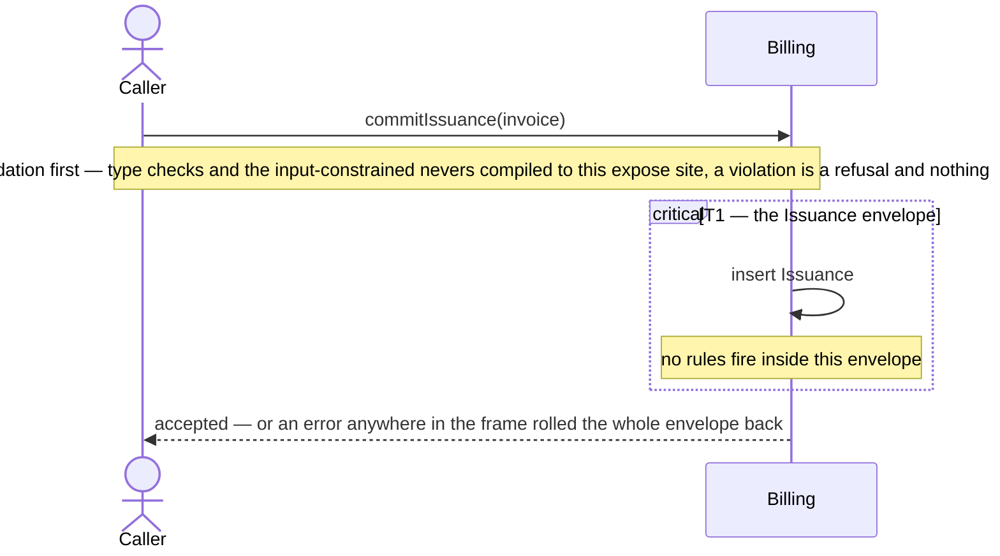

### commitChangeDueDate

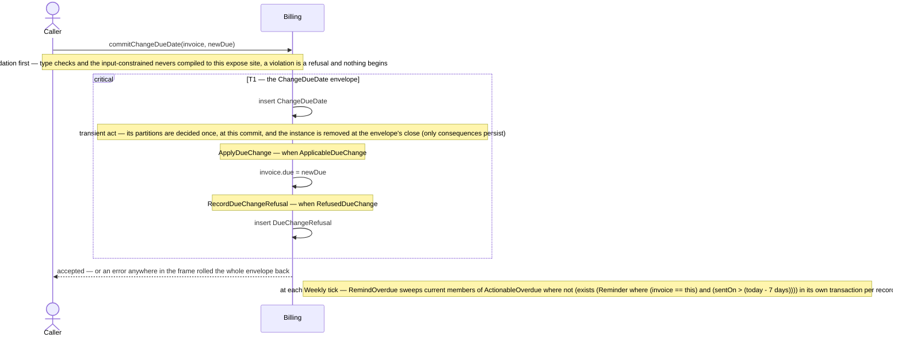

### commitArchiveRequest

### commitUnarchiveRequest

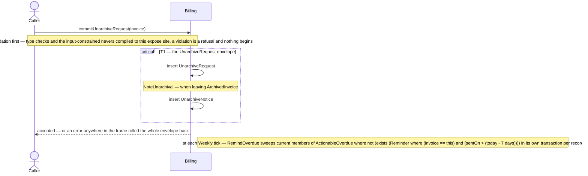
