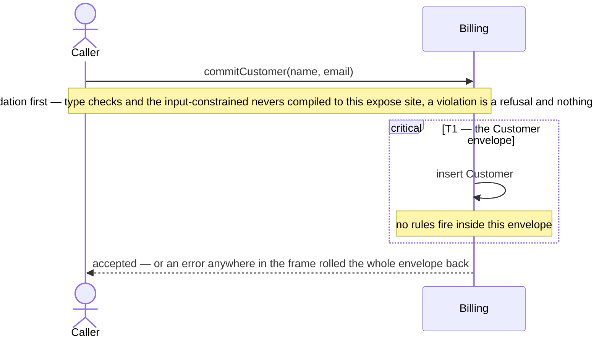
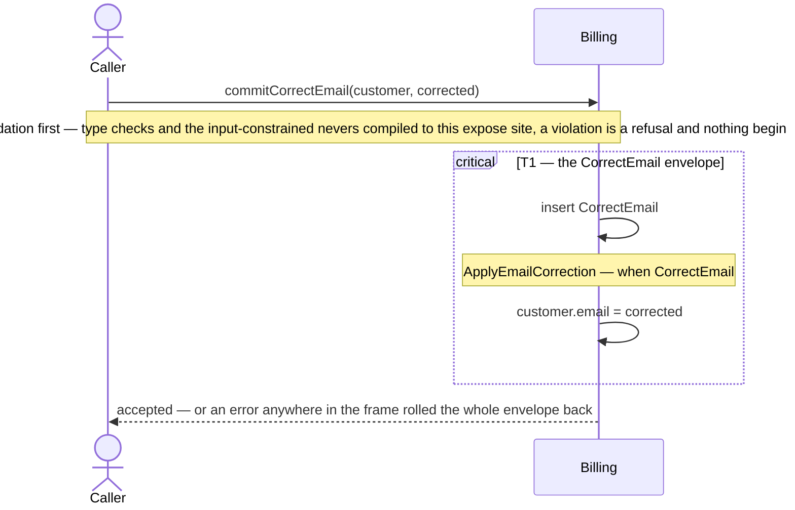
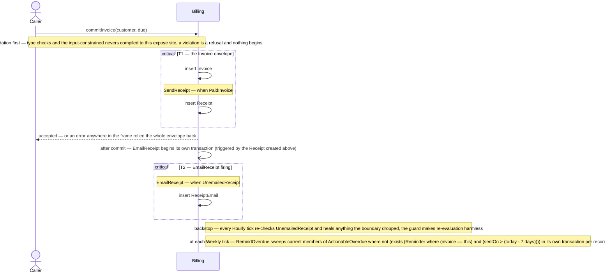
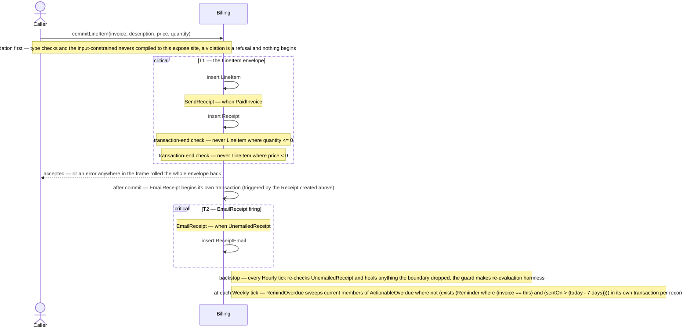
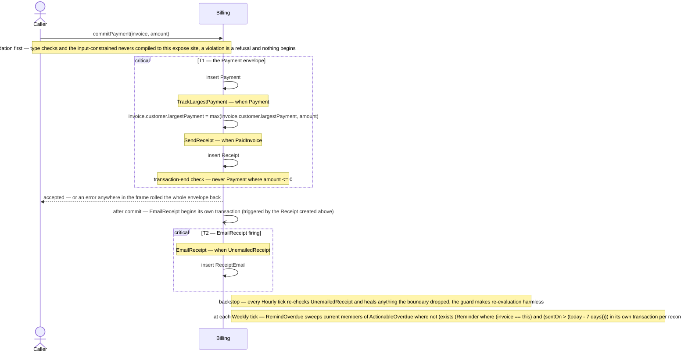
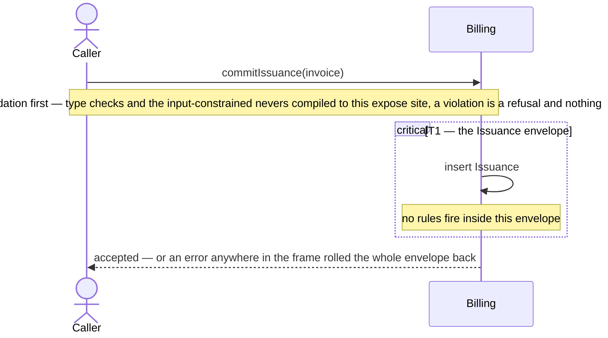
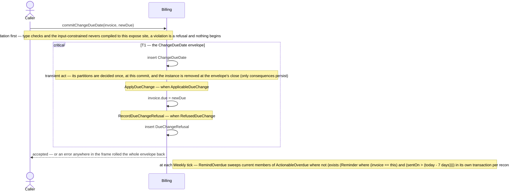
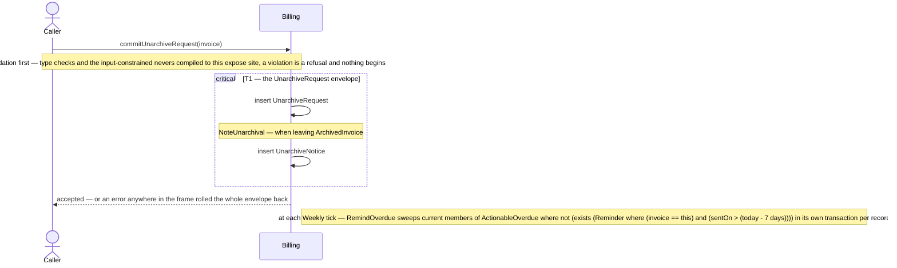

# Sequence diagrams — Billing

Generated from the spec — a deterministic projection, regenerated by `gradle generate`; do not edit. One diagram per exposed act. Each diagram is **may-fire**: a rule appears wherever the commit could affect its condition, with the condition shown as a note — whether it actually fires depends on the data at that commit. Frames (`critical`) are transaction envelopes: everything inside one frame stands or falls together.

## commitCustomer

## commitCorrectEmail

## commitInvoice

## commitLineItem

## commitPayment

## commitIssuance

## commitChangeDueDate

## commitArchiveRequest

## commitUnarchiveRequest

